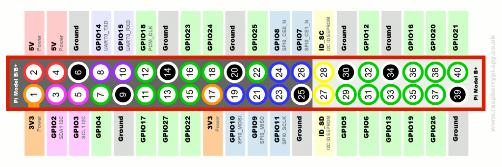

# 🌐 IoT with Raspberry Pi & ThingSpeak

### GPIO, Sensors & Cloud Integration
#### Dr. Ankit Agarwal
#### Prabhu Ram N 

---
## IoT Components

- **Sensors** → Measure temperature, humidity, light, etc.
- **Actuators** → Motors, LEDs, buzzers
- **Microcontroller/Processor** → Raspberry Pi
- **Cloud Platform** → ThingSpeak

*Imagine: Sensor → Pi → Internet → Dashboard*

---
## What is Raaspberry pi
- Single Board Computer (SBC)
- Based on ARM microprocessor
- Runs Linux OS
- Supports Python, C, Shell scripting
- Built-in:
  - Wi-Fi / Ethernet
  - USB
  - HDMI
  - GPIO


---

##  Linux OS Support

- Runs Raspberry Pi OS (Linux)
- Advantages:
  - Python libraries
  - Networking stack
  - Multitasking
  - Easy debugging

 Simplifies IoT application development

---

## Higher Processing Capability

- Handles:
  - Sensor data processing
  - JSON parsing
  - HTTPS encryption
  - Data analytics
  
---
##  Storage & File System

- SD card-based storage
- Enables:
  - Data logging
  - CSV / text files
  - Backup and recovery

Useful for analysis and monitoring

---

Power Consumption Consideration

- Raspberry Pi consumes more power than MCU

---

##  MCU vs Raspberry Pi (Comparison)

| Feature | Microcontroller | Raspberry Pi |
|------|----------------|-------------|
| Power | Low | High |
| OS | No / RTOS | Linux |
| Programming | C / Arduino | Python / C |
| Cloud APIs | Limited | Full |
| Role in IoT | End Node | Gateway |

---


## GPIO Basics

- GPIO → General Purpose Input/Output pins
- Control **sensors** & **actuators**
- Modes:
  - `BCM` → Broadcom pin numbering
  - `BOARD` → Physical pin numbering
---
### Example

```python
import RPi.GPIO as GPIO
GPIO.setmode(GPIO.BCM)
GPIO.setup(18, GPIO.OUT)
GPIO.output(18, GPIO.HIGH)
```
---
### Python Libraries for IoT
- GPIO → Control pins
- time → Delay & timing
- urllib.request → Send data to cloud via HTTP
---
### Thingspeak – Cloud Platform

- Cloud service for IoT data storage & visualization
- Supports real-time plotting
- Requires:
    -   Channel ID
    -   API keys (Write & Read)
- Website: [ThingSpeak](https://thingspeak.mathworks.com/)
---
### Write Data in ThinkSpeak
```text
GET https://api.thingspeak.com/update?api_key=YOUR_WRITE_API_KEY&field1=0

```

- update → Upload data
- api_key → Write API Key
- field1=0 → Data value

Note:
- Minimum 15 seconds delay between updates
- Returns entry ID if successful
---
### Read Data from Thinkspeak
```text
# Read all fields
GET https://api.thingspeak.com/channels/CHANNEL_ID/feeds.json?api_key=YOUR_READ_API_KEY&results=2
#Read single field
GET https://api.thingspeak.com/channels/CHANNEL_ID/fields/1.json?api_key=YOUR_READ_API_KEY&results=2

```
### JSON Output
```json
{
  "feeds": [
    {"created_at":"2026-01-01T10:00:00Z","entry_id":10,"field1":"25"},
    {"created_at":"2026-01-01T09:59:45Z","entry_id":9,"field1":"24"}
  ]
}
```


---

### Feebbank Link
